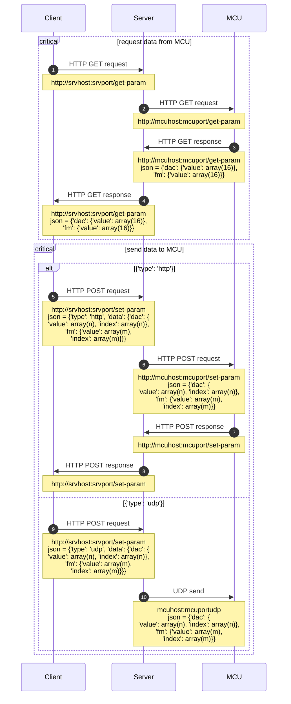
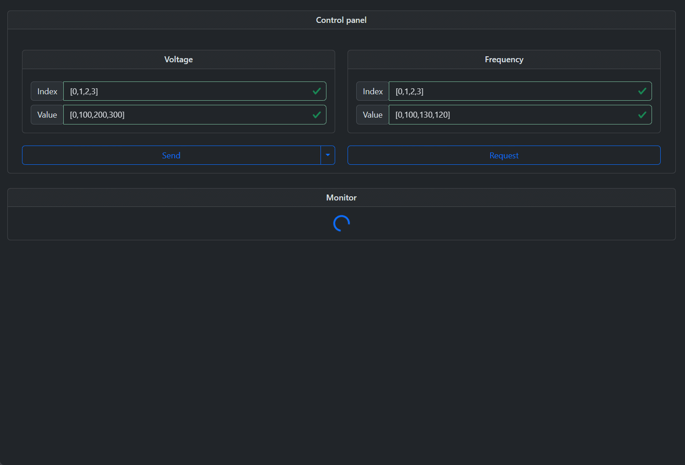

# Description
`Flask` application presents a single page GUI interface to provide JSON requesting to UDP and HTTP servers hosted by [ESP32](https://github.com/kotwiceal/mlch_dbd_act_pio_esp32) microcontroller. Simple web design was performed by exploiting `jQuery`, `webpack` and `Bootstrap` technologies. 

### Communication graph

### Preview

### Preparing to run project
1.  Install `Python` dependencies by means `poetry` package manager:
	`poetry shell`
	`poetry update`
2.  Install `JavaScript` frameworks by means `npm` package manager:
	`cd src/static`
	`npm update`
3.  Launch the application:
	`cd ../..`
	`python run.py`
****